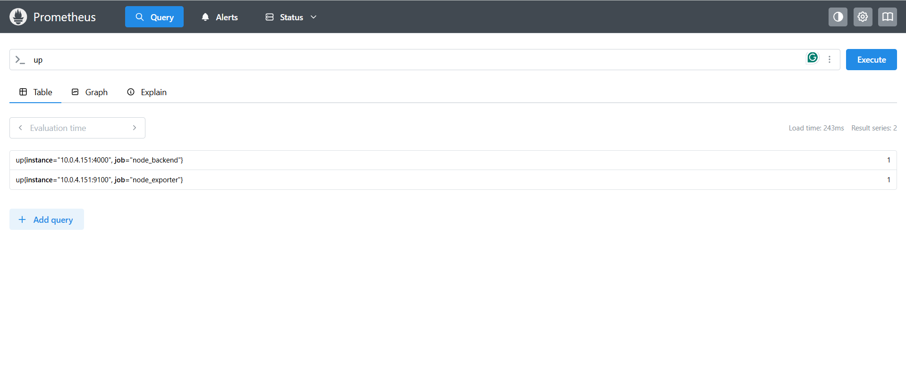

# 📡 Prometheus Monitoring Setup

This folder contains the complete monitoring setup for:

- Node Exporter
- Backend Metrics Monitoring
- Prometheus Metrics Collection
- Grafana Visualization

Prometheus collects metrics from:
- Node Exporter (`9100`)
- Node.js Backend (`4000`)

These metrics are visualized using Grafana dashboards.

---

# 📊 Architecture Flow

```text
Node Exporter ---> Prometheus ---> Grafana
Backend App  ---> Prometheus ---> Grafana
```

---

# 📦 Requirements

Before starting, ensure Docker is installed.

Check Docker version:

```bash
docker --version
```

---

# 📊 Step 1 — Run Node Exporter

Node Exporter exposes system-level metrics such as:

- CPU Usage
- Memory Usage
- Disk Usage
- Network Traffic
- System Load

Run Node Exporter container:

```bash
docker run -d \
  --name=node_exporter \
  -p 9100:9100 \
  --restart always \
  prom/node-exporter
```

Verify container:

```bash
docker ps
```

Check metrics in browser:

```bash
http://<EC2-PUBLIC-IP>:9100/metrics
```

Example:

```bash
http://54.xx.xx.xx:9100/metrics
```

---

# 📄 Step 2 — Create Prometheus Configuration

Create a configuration file:

```bash
touch prometheus.yml
```

Open the file:

```bash
nano prometheus.yml
```

Add the following configuration:

```yaml
global:
  scrape_interval: 15s

scrape_configs:
  # 🔹 Node Exporter (System Metrics)
  - job_name: "node_exporter"
    static_configs:
      - targets:
          - "10.0.4.151:9100"

  # 🔹 Node.js Backend (App Metrics)
  - job_name: "node_backend"
    static_configs:
      - targets:
          - "10.0.4.151:4000"
```

Save the file.

---

# 🚀 Step 3 — Run Prometheus Container

Run Prometheus using the configuration file:

```bash
docker run -d \
  --name prometheus \
  -p 9090:9090 \
  -v $(pwd)/prometheus.yml:/etc/prometheus/prometheus.yml \
  --restart always \
  prom/prometheus
```

Verify Prometheus container:

```bash
docker ps
```

---

# 🌐 Step 4 — Access Prometheus

Open Prometheus in browser:

```bash
http://<EC2-PUBLIC-IP>:9090
```

Example:

```bash
http://54.xx.xx.xx:9090
```

---

# 🔍 Step 5 — Verify Targets

Inside Prometheus:

1. Go to:

```text
Status → Targets
```

2. Ensure both targets are UP:

| Target | Status |
|---|---|
| node_exporter | UP |
| node_backend | UP |

---

# 📊 Metrics Collected

## 🔹 Node Exporter Metrics

- CPU Usage
- Memory Usage
- Disk Usage
- Network Traffic
- System Load
- Filesystem Metrics

---

## 🔹 Backend Metrics

- API Requests
- HTTP Status Codes
- Response Time
- Health Monitoring
- Request Throughput

---

# 📷 Prometheus Dashboard

<p align="center">
  
</p>

---

# 📌 Ports Used

| Service | Port |
|---|---|
| Backend | 4000 |
| Node Exporter | 9100 |
| Prometheus | 9090 |

---

# 🛠️ Useful Docker Commands

## View Running Containers

```bash
docker ps
```

---

## View Prometheus Logs

```bash
docker logs prometheus
```

---

## View Node Exporter Logs

```bash
docker logs node_exporter
```

---

## Restart Prometheus

```bash
docker restart prometheus
```

---

## Stop Prometheus

```bash
docker stop prometheus
```

---

## Remove Prometheus Container

```bash
docker rm -f prometheus
```

---

# 🛠️ Technologies Used

- Prometheus
- Node Exporter
- Docker
- Grafana
- Node.js

---

# 👨‍💻 Author

**M VISHNUVARDHAN REDDY**
