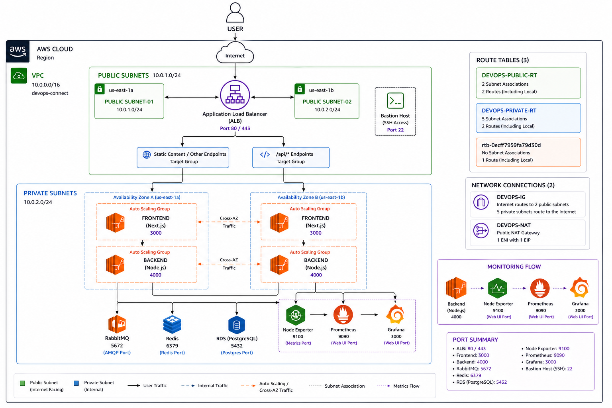
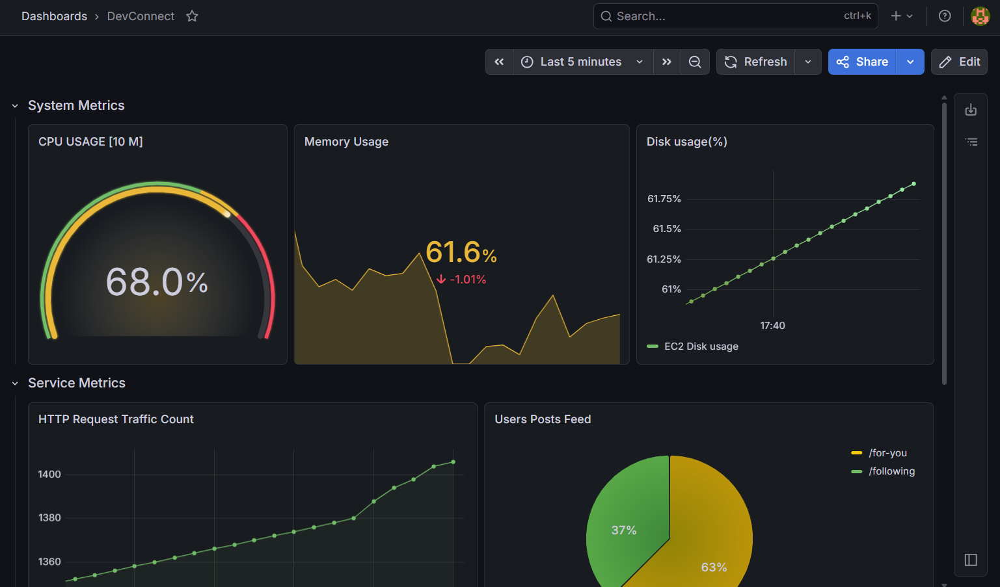
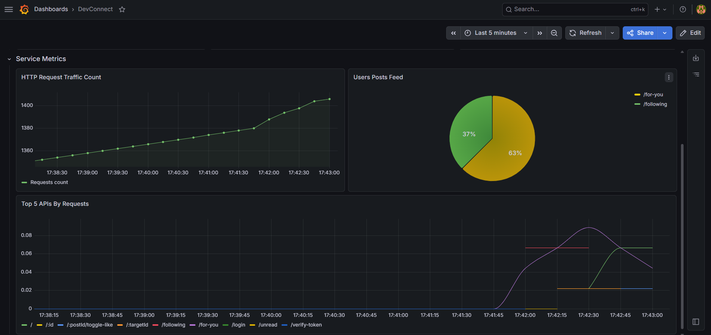

# 🚀 DevOpsConnect Monorepo

This repository contains the full-stack **DevOpsConnect** application, organized as a monorepo with separate folders for backend, frontend, monitoring, and infrastructure services.

---

# 🧠 System Architecture

<p align="center">
  
</p>

## 📌 Overview

The application is deployed using a secure and scalable AWS architecture.

### Infrastructure Includes:
- VPC (Virtual Private Cloud)
- Public & Private Subnets
- Application Load Balancer
- Auto Scaling Groups
- Redis
- RabbitMQ
- PostgreSQL RDS
- Prometheus
- Grafana

---

# 🔄 Request Flow

1. User sends request through the internet
2. Request reaches the **Application Load Balancer (ALB)**
3. ALB routes traffic:
   - `/api/*` → Backend (Node.js)
   - Other routes → Frontend (Next.js)
4. Backend communicates with:
   - Redis
   - RabbitMQ
   - PostgreSQL RDS
5. Prometheus collects metrics
6. Grafana visualizes metrics dashboards

---

# 🔐 Security

- Only the **Load Balancer** is publicly accessible
- Backend services are deployed inside **private subnets**
- Databases are not exposed publicly
- Bastion Host is used for secure SSH access
- NAT Gateway provides outbound internet access

---

# ⚖️ High Availability

- Multi-AZ deployment:
  - `us-east-1a`
  - `us-east-1b`
- Auto Scaling Groups for frontend & backend
- Cross-AZ traffic handling
- Fault-tolerant architecture

---

# 📊 Monitoring Stack

The project uses:
- **Node Exporter**
- **Prometheus**
- **Grafana**

---

# 📈 Grafana Dashboard 1

<p align="center">
  
</p>

## 📌 Description

Dashboard displays:
- CPU Usage
- Memory Usage
- Disk Usage
- Network Monitoring
- System Metrics

---

# 📈 Grafana Dashboard 2

<p align="center">
  
</p>

## 📌 Description

Dashboard provides:
- Backend API Metrics
- Request Monitoring
- Service Health
- Real-Time Infrastructure Insights

---

# 📡 Prometheus Metrics

<p align="center">
  
</p>

## 📌 Description

Prometheus collects metrics from:
- Node Exporter (`9100`)
- Backend Service (`4000`)

Metrics are scraped every `15 seconds`.

---

# 🖥️ EC2 Instances

<p align="center">
  
</p>

## 📌 Description

Multiple EC2 instances are used for:
- Frontend
- Backend
- Redis
- RabbitMQ
- Monitoring Services

---

# 🗄️ RDS (PostgreSQL)

<p align="center">
  
</p>

## 📌 Description

Managed PostgreSQL database using AWS RDS.

### Features:
- Automated Backups
- High Availability
- Secure Private Access
- Backend-Only Connectivity

---

# 📡 Request Checking

<p align="center">
  
</p>

## 📌 Description

Demonstrates:
- API Request Flow
- HTTP Methods
- Status Codes
- Successful Backend Communication

---

# 📁 Project Structure

```bash
backend/        # Node.js + Express backend
frontend/       # Next.js frontend
grafana/        # Grafana setup
prometheus/     # Prometheus configuration
rabbitMq/       # RabbitMQ Docker setup
reddis/         # Redis Docker setup
