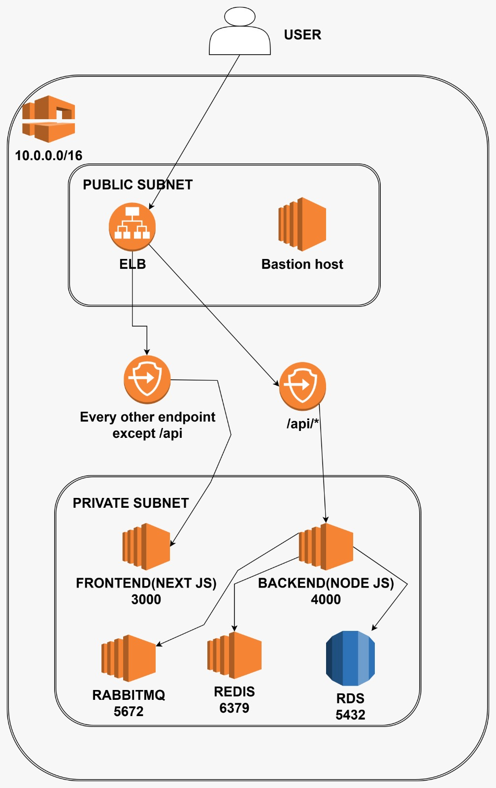
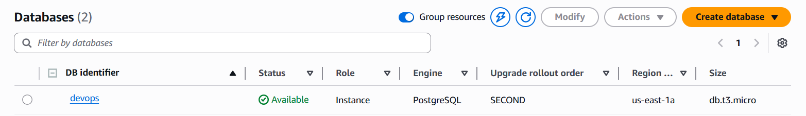
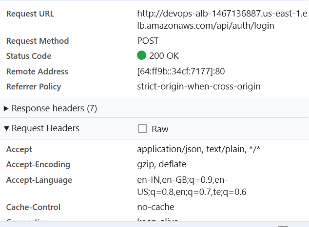

# 🚀 DevOpsConnect Monorepo

This repository contains the full-stack **DevOpsConnect** application, organized as a monorepo with separate folders for backend, frontend, and infrastructure services.

---
## 🧠 System Architecture

<p align="center">
  
</p>

### 📌 Overview
The application is deployed using a secure and scalable AWS architecture:

- The system runs inside a **VPC (Virtual Private Cloud)**  
- It is divided into:
  - **Public Subnet** → Load Balancer & Bastion Host  
  - **Private Subnet** → Application & Databases  

### 🔄 Request Flow
1. User sends request  
2. Request reaches **Load Balancer (ELB)**  
3. Routing:
   - `/api` → Backend (Node.js)  
   - Other routes → Frontend (Next.js)  
4. Backend communicates with:
   - **Redis** (caching)  
   - **RabbitMQ** (message queue)  
   - **RDS** (PostgreSQL database)  

### 🔐 Security
- Only **Load Balancer** is publicly accessible  
- Backend and database are inside **private subnet**  
- **Bastion Host** is used for secure SSH access  

---

## 🌐 VPC Setup


### 📌 Description
- Defines the network structure of the application  
- Includes:
  - VPC CIDR block  
  - Public & Private subnets  
  - Route tables  
  - Internet Gateway & NAT Gateway  

---

## 🖥️ EC2 Instances


### 📌 Description
- Multiple EC2 instances are used for:
  - Frontend  
  - Backend  
  - Redis  
  - RabbitMQ  
- Instances are distributed for **scalability and fault tolerance**

---

## 🗄️ RDS (Database)



### 📌 Description
- Managed **PostgreSQL database** using AWS RDS  
- Provides:
  - Automated backups  
  - High availability  
  - Secure access from backend only  

---

## 📡 Request Checking



### 📌 Description
- Demonstrates API request flow  
- Shows:
  - Request URL  
  - HTTP Method (POST)  
  - Status Code (200 OK)  
- Confirms backend API is working correctly via Load Balancer  

---

## Project Structure

- `backend/` — Node.js/Express API (PostgreSQL, Redis, RabbitMQ, AWS S3)
- `frontend/` — Next.js/React client
- `rabbitMq/` — Docker setup for RabbitMQ
- `reddis/` — Docker setup for Redis

## Quick Start

1. **Clone the repository:**
	```bash
	git clone <repo-url>
	cd "DevOpsConnect application with different Architectures"
	```

2. **Setup Backend:**
	```bash
	cd backend
	cp .env.example .env
	npm install
	npm run dev
	```

3. **Setup Frontend:**
	```bash
	cd ../frontend
	cp .env.example .env
	npm install
	npm run dev
	```

4. **(Optional) Run Redis and RabbitMQ with Docker:**
	```bash
	cd ../reddis
	docker build -t devopsconnect-redis .
	docker run -d --name redis -p 6379:6379 devopsconnect-redis

	cd ../rabbitMq
	docker build -t devopsconnect-rabbitmq .
	docker run -d --name rabbitmq \
	  -e RABBITMQ_DEFAULT_USER=admin \
	  -e RABBITMQ_DEFAULT_PASS=adminpassword \
	  -p 5672:5672 -p 15672:15672 devopsconnect-rabbitmq
	```

## Environment Variables

Each folder contains a `.env.example` file. Copy it to `.env` and fill in your values. **Do not commit `.env` files.**

## Production

- Build frontend: `npm run build` in `frontend/`
- Start backend: `npm start` in `backend/`
- Start frontend: `npm start` in `frontend/`

---
